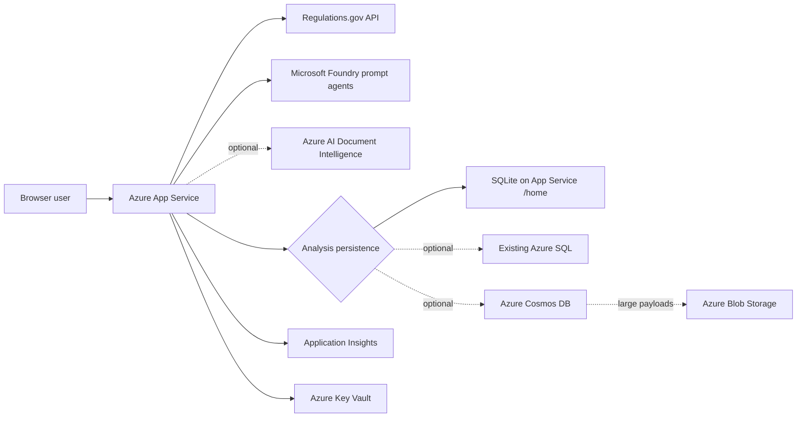

# Azure Deployment Runbook

This runbook deploys the .NET 9 Blazor Server application in this folder to Azure App Service by using Azure Developer CLI (`azd`) and Bicep.

The deployment reuses an existing Microsoft Foundry project and existing prompt agents. It does not create, publish, or modify Foundry agents or model deployments.

## Deployment architecture



The App Service uses a system-assigned managed identity for Azure service access. The Regulations.gov API key remains a Key Vault secret referenced by an App Service setting.

## What the Bicep template deploys

### Always deployed

| Resource | Purpose |
| --- | --- |
| Linux App Service plan | Hosts the web application. The default SKU is `B1`. |
| Linux App Service | Runs the .NET 9 Blazor Server application. |
| System-assigned managed identity | Authenticates the app to Azure services without application secrets. |
| Key Vault | Stores the Regulations.gov API key and Foundry project endpoint. |
| Key Vault Secrets User assignment | Lets the App Service resolve its Key Vault references. |
| Log Analytics workspace | Stores Application Insights telemetry. |
| Application Insights | Receives OpenTelemetry requests, dependencies, logs, traces, and custom metrics. |
| App Service health check | Calls `/health/ready`; `/health/live` is also available. |
| Azure Monitor metric alerts | Detects HTTP 5xx responses and sustained response latency. |

### Conditionally deployed

| Condition | Resources |
| --- | --- |
| `ENABLE_ATTACHMENT_OCR=true` | Document Intelligence S0 account and Cognitive Services Data Reader assignment. |
| `ENABLE_PAYLOAD_STORAGE=true` | Private Blob container, storage account, and Storage Blob Data Contributor assignment. |
| `PROVISION_COSMOS_RESOURCES=true` | Serverless Cosmos account, database, aggregate container, summary container, and Cosmos DB Built-in Data Contributor assignment. |
| `ALERT_EMAIL` is nonempty | Azure Monitor action group with an email receiver. |

The Blob resource is currently used only by the Cosmos provider. Disable `ENABLE_PAYLOAD_STORAGE` when using SQLite or Azure SQL unless you intentionally want the storage account available for a later migration.

## Choose a deployment profile

Choose one profile before creating the azd environment.

| Profile | Suitable for | Required settings | Important constraint |
| --- | --- | --- | --- |
| SQLite | Evaluation, development, or one App Service instance | `PERSISTENCE_PROVIDER=Sqlite` | The database is a file under `/home`; do not scale the app to multiple instances. |
| Existing Azure SQL | Production workloads that need relational storage and scale-out | `PERSISTENCE_PROVIDER=AzureSql`, `ANALYSIS_DB_CONNECTION_STRING` | The App Service identity needs a contained database user and schema-creation permission for first startup. |
| Existing Cosmos DB | Existing Cosmos account managed outside this template | `PERSISTENCE_PROVIDER=Cosmos`, `COSMOS_ENDPOINT`, container names | Containers, indexes, and data-plane RBAC must exist before app startup. |
| Template-managed Cosmos DB | New serverless Cosmos deployment | `PERSISTENCE_PROVIDER=Cosmos`, `PROVISION_COSMOS_RESOURCES=true` | Creates billable Cosmos resources and should be reviewed with `azd provision --preview`. |

For large analysis runs, prefer Azure SQL or Cosmos with Blob payload offload. Cosmos still enforces a 2 MB item limit on the bounded aggregate metadata.

## Prerequisites

### Local tools

Install and verify:

```powershell
dotnet --version
az --version
azd version
az bicep version
```

Required versions and services:

- .NET 9 SDK.
- Azure CLI.
- Azure Developer CLI.
- Bicep CLI through Azure CLI.
- Git.

### Azure permissions

The deploying principal needs:

- Permission to create resources in the target resource group, normally Contributor.
- Permission to create role assignments, normally Owner or User Access Administrator plus Contributor.
- Permission to read the existing Foundry project and assign its inference role, or help from its owner.
- For Azure SQL, permission to create an Entra database user or assistance from the SQL Entra administrator.
- For an existing Cosmos account, permission to create a Cosmos SQL data-plane role assignment or assistance from its owner.

A deployment can create resources successfully and still leave the application unusable if role-assignment permissions are missing.

### Required external services

Prepare these before deploying:

1. A Regulations.gov API key from <https://open.gsa.gov/api/regulationsgov/>.
2. A Microsoft Foundry project endpoint in this form:

   ```text
   https://<resource>.services.ai.azure.com/api/projects/<project>
   ```

3. Published prompt-agent names and versions for:
   - Per-comment categorization.
   - Grouping and collective analysis.
   - Optional follow-up Q&A.
4. A model deployment already configured on those prompt agents.

The Bicep template stores agent names and versions as application settings because they are identifiers, not secrets.

### Resource-provider registration

If the subscription is new, confirm these providers are registered:

```powershell
$providers = @(
    "Microsoft.Authorization",
    "Microsoft.CognitiveServices",
    "Microsoft.DocumentDB",
    "Microsoft.Insights",
    "Microsoft.KeyVault",
    "Microsoft.OperationalInsights",
    "Microsoft.Storage",
    "Microsoft.Web"
)

foreach ($provider in $providers) {
    az provider register --namespace $provider
}
```

Registration can take several minutes. Query a provider with:

```powershell
az provider show --namespace Microsoft.Web --query registrationState -o tsv
```

## Step 1: Validate the repository locally

Run these commands from the repository root before touching Azure:

```powershell
dotnet restore .\dotnet_frontend.Tests\DoedRegulatoryComments.Web.Tests.csproj
dotnet build .\dotnet_frontend\DoedRegulatoryComments.Web.csproj --configuration Release
dotnet test .\dotnet_frontend.Tests\DoedRegulatoryComments.Web.Tests.csproj --configuration Release
dotnet test .\dotnet_frontend.Tests\DoedRegulatoryComments.Web.Tests.csproj --configuration Release --filter Category=AiEvaluation
dotnet list .\dotnet_frontend\DoedRegulatoryComments.Web.csproj package --vulnerable --include-transitive
az bicep build --file .\dotnet_frontend\infra\main.bicep
az bicep build-params --file .\dotnet_frontend\infra\main.bicepparam
```

The CI workflow runs equivalent checks for pull requests and pushes to `main`.

## Step 2: Authenticate to the correct tenant

If the target subscription belongs to a specific tenant, use that tenant explicitly:

```powershell
azd auth login --tenant-id <tenant-id>
az login --tenant <tenant-id>
```

Verify azd authentication:

```powershell
azd auth login --check-status
```

A common cause of a `403 AuthorizationFailed` response is being signed into the correct account but the wrong Entra tenant.

## Step 3: Create a unique azd environment

From the web project folder:

```powershell
cd dotnet_frontend
azd env new doed-comments-<unique-suffix> --no-prompt
azd env set AZURE_SUBSCRIPTION_ID <subscription-id>
azd env set AZURE_LOCATION eastus
```

Use a unique environment name instead of `dev`, `test`, or `prod`; azd derives resource-group and resource names from the environment.

Check non-secret coordinates individually:

```powershell
azd env get-value AZURE_ENV_NAME
azd env get-value AZURE_SUBSCRIPTION_ID
azd env get-value AZURE_LOCATION
```

Treat the complete output of `azd env get-values` as sensitive because it includes `REGS_API_KEY`.

## Step 4: Set required application values

```powershell
azd env set REGS_API_KEY <regulations-gov-api-key>
azd env set FOUNDRY_PROJECT_ENDPOINT "https://<resource>.services.ai.azure.com/api/projects/<project>"
azd env set FOUNDRY_CATEGORIZATION_AGENT_NAME RegulatoryCommentCategorizationAgent
azd env set FOUNDRY_CATEGORIZATION_AGENT_VERSION latest
azd env set FOUNDRY_GROUPING_AGENT_NAME RegulatoryCommentGroupingAgent
azd env set FOUNDRY_GROUPING_AGENT_VERSION latest
```

Optional follow-up agent:

```powershell
azd env set FOUNDRY_FOLLOWUP_AGENT_NAME RegulatoryCommentFollowUpAgent
azd env set FOUNDRY_FOLLOWUP_AGENT_VERSION latest
```

The following value is informational; each prompt agent selects its own model in Foundry:

```powershell
azd env set FOUNDRY_MODEL_DEPLOYMENT gpt-5.4
```

Do not rely on the sample endpoint default in `main.bicepparam`. Always set `FOUNDRY_PROJECT_ENDPOINT` for the target environment.

## azd environment-variable reference

`main.bicepparam` maps these azd values into Bicep parameters. Defaults below are the checked-in
values, not a recommendation for every environment.

### Environment and Foundry

| Variable | Required | Default | Purpose |
| --- | --- | --- | --- |
| `AZURE_ENV_NAME` | Yes | Created by `azd env new` | Unique azd environment and naming context. |
| `AZURE_SUBSCRIPTION_ID` | Yes | None | Target subscription. |
| `AZURE_LOCATION` | Yes | None | Resource-group and Azure resource location. |
| `REGS_API_KEY` | Yes | Empty | Regulations.gov API key; becomes a Key Vault secret. |
| `FOUNDRY_PROJECT_ENDPOINT` | Yes | Sample endpoint in `main.bicepparam` | Existing Foundry project endpoint. Always override it. |
| `FOUNDRY_CATEGORIZATION_AGENT_NAME` | Yes | `RegulatoryCommentCategorizationAgent` | Per-comment prompt agent name. |
| `FOUNDRY_CATEGORIZATION_AGENT_VERSION` | Yes | `latest` | Categorization agent version; pin for reproducibility. |
| `FOUNDRY_GROUPING_AGENT_NAME` | Yes | `RegulatoryCommentGroupingAgent` | Grouping/collective-analysis prompt agent name. |
| `FOUNDRY_GROUPING_AGENT_VERSION` | Yes | `latest` | Grouping agent version; pin for reproducibility. |
| `FOUNDRY_FOLLOWUP_AGENT_NAME` | No | Empty | Follow-up Q&A agent; empty disables follow-up chat. |
| `FOUNDRY_FOLLOWUP_AGENT_VERSION` | No | `latest` | Follow-up agent version. |
| `FOUNDRY_MODEL_DEPLOYMENT` | No | `gpt-5.4` | Informational setting; prompt agents choose their configured model. |

### Persistence

| Variable | Required | Default | Purpose |
| --- | --- | --- | --- |
| `PERSISTENCE_PROVIDER` | Yes | `Sqlite` | `Sqlite`, `AzureSql`, or `Cosmos`. |
| `ANALYSIS_DB_CONNECTION_STRING` | Azure SQL only | Empty | Passwordless Azure SQL connection string. |
| `COSMOS_ENDPOINT` | Existing Cosmos only | Empty | Existing Cosmos account endpoint. |
| `COSMOS_DATABASE_NAME` | Cosmos only | `doed-regulatory-comments` | Database containing run documents. |
| `COSMOS_CONTAINER_NAME` | Cosmos only | `analysis-runs` | Aggregate container, partitioned by `/id`. |
| `COSMOS_SUMMARY_CONTAINER_NAME` | Cosmos only | `analysis-run-summaries` | Summary container, partitioned by `/documentIdNormalized`. |
| `COSMOS_CREATE_IF_NOT_EXISTS` | No | `false` | Let the app attempt database/container creation at startup. Prefer IaC. |
| `PROVISION_COSMOS_RESOURCES` | No | `false` | Provision serverless Cosmos in this template. Set provider to `Cosmos` too. |
| `COSMOS_ACCOUNT_NAME` | No | Generated | Optional globally unique account name for provisioned Cosmos. |
| `ANALYSIS_FUNCTION_BASE_URL` | Function backend only | Empty | HTTPS base URL of the Function App. |
| `ANALYSIS_FUNCTION_KEY` | Function backend only | Empty | Server-side Function key; never expose it to browser code. |
| `ANALYSIS_PAYLOAD_BLOB_CONTAINER_URI` | Function backend only | Empty | Private Function-storage container used to hydrate offloaded categorization payloads. |

### Optional services and operations

| Variable | Required | Default | Purpose |
| --- | --- | --- | --- |
| `ENABLE_ATTACHMENT_OCR` | No | `true` in `main.bicepparam` | Provision Document Intelligence and configure OCR. |
| `ENABLE_PAYLOAD_STORAGE` | No | `true` in `main.bicepparam` | Provision Blob payload storage. Disable for SQLite/Azure SQL unless intentionally retained. |
| `FOUNDRY_INPUT_USD_PER_MILLION_TOKENS` | No | `0` | Input-token rate used for estimated-cost telemetry. |
| `FOUNDRY_OUTPUT_USD_PER_MILLION_TOKENS` | No | `0` | Output-token rate used for estimated-cost telemetry. |
| `ALERT_EMAIL` | No | Empty | Email receiver for the Azure Monitor action group. |

These Bicep settings are currently edited in `main.bicepparam` rather than set through azd:

| Parameter | Default | Notes |
| --- | ---: | --- |
| `baseName` | `doedweb` | Resource-name prefix; 3-15 characters. |
| `appServicePlanSku` | `B1` | Allowed B/Pv3 SKUs are enforced by Bicep. |
| `defaultDocumentId` | `ED-2025-SCC-0481-0001` | UI default. |
| `batchSize` | `5` | Grouping batch size, 1-20. |
| `payloadOffloadThresholdBytes` | `524288` | Cosmos raw-payload offload threshold. |

For the integrated Function-owned analysis topology, prefer the repository-root `deploy.ps1`. It resolves these three backend settings, creates the payload container, and applies Cosmos and Blob data-plane roles automatically. Direct `azd` deployment remains available for frontend-only or manually managed environments.

## Step 5: Configure persistence

### Profile A: SQLite

```powershell
azd env set PERSISTENCE_PROVIDER Sqlite
azd env set ENABLE_PAYLOAD_STORAGE false
```

The connection string becomes:

```text
Data Source=/home/data/analysis.db
```

Operational requirements:

- Keep App Service at one instance.
- Back up `/home/data/analysis.db` before risky upgrades.
- Use Azure SQL or Cosmos before enabling horizontal scale-out.
- B1 does not enable Always On in this template; use a supported higher SKU if cold starts are unacceptable.

### Profile B: existing Azure SQL

```powershell
azd env set PERSISTENCE_PROVIDER AzureSql
azd env set ANALYSIS_DB_CONNECTION_STRING "Server=tcp:<server>.database.windows.net,1433;Database=<database>;Authentication=Active Directory Default;Encrypt=True;TrustServerCertificate=False;"
azd env set ENABLE_PAYLOAD_STORAGE false
```

After the App Service exists, create a contained user for its managed identity. Run this as the Azure SQL Entra administrator:

```sql
CREATE USER [<app-service-name>] FROM EXTERNAL PROVIDER;
ALTER ROLE db_datareader ADD MEMBER [<app-service-name>];
ALTER ROLE db_datawriter ADD MEMBER [<app-service-name>];
ALTER ROLE db_ddladmin ADD MEMBER [<app-service-name>];
```

Start the app once so it creates its four tables, then remove ongoing DDL permission:

```sql
ALTER ROLE db_ddladmin DROP MEMBER [<app-service-name>];
```

Use a passwordless Entra connection string. Do not place SQL passwords in `main.bicepparam` or source control.

### Profile C: existing Cosmos DB

Create these containers in the same database:

| Container | Partition key | Purpose |
| --- | --- | --- |
| `analysis-runs` | `/id` | Full bounded analysis aggregate. |
| `analysis-run-summaries` | `/documentIdNormalized` | Compact, pageable Library records and exact document filtering. |

Then set:

```powershell
azd env set PERSISTENCE_PROVIDER Cosmos
azd env set PROVISION_COSMOS_RESOURCES false
azd env set COSMOS_ENDPOINT "https://<account>.documents.azure.com:443/"
azd env set COSMOS_DATABASE_NAME doed-regulatory-comments
azd env set COSMOS_CONTAINER_NAME analysis-runs
azd env set COSMOS_SUMMARY_CONTAINER_NAME analysis-run-summaries
azd env set COSMOS_CREATE_IF_NOT_EXISTS false
azd env set ENABLE_PAYLOAD_STORAGE true
```

Recommended aggregate-container indexing:

- Include normal metadata paths.
- Exclude `/categorizations/[]/rawResponse/?`.
- Exclude `/categorizations/[]/parsedJson/?`.
- Exclude `/followUpHistory/[]/text/?`.

Recommended summary-container composite indexes:

- `/type` ascending and `/startedAt` descending.
- `/type` ascending, `/succeeded` ascending, and `/startedAt` descending.

Grant the App Service identity Cosmos DB Built-in Data Contributor after deployment:

```powershell
$principalId = az webapp identity show `
  --resource-group <web-resource-group> `
  --name <web-app-name> `
  --query principalId -o tsv

az cosmosdb sql role assignment create `
  --resource-group <cosmos-resource-group> `
  --account-name <cosmos-account-name> `
  --scope "/" `
  --principal-id $principalId `
  --role-definition-id 00000000-0000-0000-0000-000000000002
```

On first Library access, schema-v2 code performs a leased, one-time summary backfill for legacy aggregate documents. Existing inline payloads remain readable. Large-payload offload applies to new or newly saved runs and does not rewrite historical documents automatically.

### Profile D: template-managed serverless Cosmos DB

```powershell
azd env set PERSISTENCE_PROVIDER Cosmos
azd env set PROVISION_COSMOS_RESOURCES true
azd env set COSMOS_DATABASE_NAME doed-regulatory-comments
azd env set COSMOS_CONTAINER_NAME analysis-runs
azd env set COSMOS_SUMMARY_CONTAINER_NAME analysis-run-summaries
azd env set ENABLE_PAYLOAD_STORAGE true
```

Optionally choose a globally unique account name:

```powershell
azd env set COSMOS_ACCOUNT_NAME <globally-unique-lowercase-name>
```

The template creates serverless Cosmos resources, indexing policies, partition keys, and the app's data-plane role assignment.

## Step 6: Configure optional services

### Scanned-PDF OCR

The checked-in `main.bicepparam` enables OCR unless overridden:

```powershell
azd env set ENABLE_ATTACHMENT_OCR true
```

This provisions Document Intelligence and assigns Cognitive Services Data Reader to the App Service identity. The app sends only sparse/scanned PDFs to the `prebuilt-read` model, up to the configured OCR page limit.

Disable OCR to avoid the resource and usage charges:

```powershell
azd env set ENABLE_ATTACHMENT_OCR false
```

### Large Cosmos payload storage

```powershell
azd env set ENABLE_PAYLOAD_STORAGE true
```

The template provisions a storage account that has:

- Shared-key authorization disabled.
- Public blob access disabled.
- OAuth as the default authorization method.
- Soft delete enabled for blobs and containers.
- Storage Blob Data Contributor assigned to the App Service identity.

Categorization payloads above 512 KB are gzip-compressed into the `analysis-run-payloads` container. Cosmos stores only the blob name and bounded metadata.

### Estimated Foundry cost telemetry

Set current model pricing in USD per one million tokens:

```powershell
azd env set FOUNDRY_INPUT_USD_PER_MILLION_TOKENS "<input-rate>"
azd env set FOUNDRY_OUTPUT_USD_PER_MILLION_TOKENS "<output-rate>"
```

Leave both at `0` when pricing is unknown. Token counts are still collected; estimated cost remains zero.

### Alert email

```powershell
azd env set ALERT_EMAIL operations@example.gov
```

An empty value creates metric alerts without notification actions. Configure an action group later if email is not appropriate.

## Step 7: Review the deployment plan

Compile infrastructure and preview Azure changes:

```powershell
az bicep build --file .\infra\main.bicep
az bicep build-params --file .\infra\main.bicepparam
azd provision --preview --no-prompt
```

Review the preview for:

- Target subscription and location.
- Resource names and selected App Service SKU.
- Whether OCR, Blob, and Cosmos resources are expected.
- Role assignments at the intended scopes.
- Organizational policy denials.
- Unexpected resource replacement or deletion.

Package the application before provisioning:

```powershell
azd package --no-prompt
```

This app does not use Docker or .NET Aspire. Docker-context and Aspire validation steps are not applicable.

## Step 8: Deploy

For the first deployment:

```powershell
azd up
```

`azd up` performs both infrastructure provisioning and application deployment. Read the summary before confirming any prompt.

For noninteractive automation after the environment is fully configured:

```powershell
azd up --no-prompt
```

Do not run deployment with an empty Regulations.gov API key or an unset Foundry endpoint.

## Step 9: Complete post-deployment access

### Foundry project role

The Foundry project is external to this Bicep deployment, so its role assignment cannot be created automatically. The deployment outputs a `foundryRoleAssignmentCommand` containing the App Service principal ID.

Copy the full Foundry project ARM resource ID from the Foundry portal and replace the placeholder in that emitted command. Run the resulting role assignment once.

Depending on the Foundry resource generation and tenant, the inference role can appear as Azure AI User or Foundry User. Use the role emitted by the template when available and confirm that it grants access to prompt-agent Responses API operations.

### Existing Cosmos role

For Profile C, run the Cosmos data-plane assignment shown earlier. Profile D creates it automatically.

### Azure SQL user

For Profile B, create the contained database user and roles shown earlier. The Bicep deployment cannot grant database roles inside an existing SQL database.

## Step 10: Verify the deployment

### Inspect outputs

The deployment emits:

| Output | Meaning |
| --- | --- |
| `webAppName` | App Service resource name. |
| `webAppUrl` | Browser URL. |
| `webAppPrincipalId` | Managed-identity object ID. |
| `keyVaultName` | Key Vault containing application secrets. |
| `livenessUrl` | Process health endpoint. |
| `readinessUrl` | Persistence-aware health endpoint. |
| `documentIntelligenceEndpoint` | OCR endpoint when enabled. |
| `payloadContainerUri` | Blob payload container when enabled. |
| `effectiveCosmosEndpoint` | Existing or provisioned Cosmos endpoint. |
| `foundryRoleAssignmentCommand` | Manual Foundry RBAC command. |

Use `azd show` and the deployment output to find the service URL.

### Test health endpoints

```powershell
$webUrl = "https://<web-app-hostname>"
Invoke-WebRequest "$webUrl/health/live"
Invoke-WebRequest "$webUrl/health/ready"
```

Expected result: HTTP 200 and `Healthy`.

- `/health/live` verifies the process can answer HTTP requests.
- `/health/ready` verifies the primary configured persistence provider is reachable.
- The optional Cosmos summary container is treated as an optimization and does not make readiness fail when aggregate fallback remains available.

### Test the user workflow

1. Open the web URL.
2. Confirm the Settings page shows the expected endpoint and agents.
3. Fetch a small known docket or a small manually selected comment set.
4. Run an analysis.
5. Confirm it appears in Library.
6. Reopen the saved run.
7. If configured, start a follow-up Q&A turn.
8. Download at least one report format.
9. Test a comment with an attachment.
10. If OCR is enabled, test a scanned PDF and confirm its text source reports OCR.

### Verify telemetry

Allow several minutes for ingestion, then check Application Insights for:

- Incoming requests and HTTP dependencies.
- Analysis job traces and phase durations.
- Foundry request duration, tokens, retries, and 429 responses.
- Estimated Foundry cost when token prices are configured.
- Attachment download size, failures, and OCR outcome.
- Cosmos request-unit consumption.

Custom metric names include:

```text
analysis.jobs
analysis.duration
analysis.phase.duration
foundry.tokens
foundry.estimated_cost
foundry.request.duration
foundry.retries
foundry.rate_limits
attachments.failures
attachments.download.size
attachments.ocr
cosmos.request_charge
```

Telemetry deliberately excludes API keys, prompt text, response text, comment bodies, and attachment content.

## Runtime configuration mapping

Azure uses double underscores to represent nested .NET configuration keys. Important mappings include:

| Azure app setting | .NET configuration key |
| --- | --- |
| `Api__ApiKey` | `Api:ApiKey` |
| `Api__FoundryEndpoint` | `Api:FoundryEndpoint` |
| `Persistence__Provider` | `Persistence:Provider` |
| `Persistence__Cosmos__Endpoint` | `Persistence:Cosmos:Endpoint` |
| `Persistence__Payloads__BlobContainerUri` | `Persistence:Payloads:BlobContainerUri` |
| `Attachments__OcrEndpoint` | `Attachments:OcrEndpoint` |
| `Telemetry__FoundryCost__InputUsdPerMillionTokens` | `Telemetry:FoundryCost:InputUsdPerMillionTokens` |
| `APPLICATIONINSIGHTS_CONNECTION_STRING` | Azure Monitor OpenTelemetry connection string |

Configuration precedence for API and Foundry settings is:

1. Runtime overrides saved from the Settings page.
2. Azure App Service settings or environment variables.
3. `appsettings.json` defaults.

The Settings page stores runtime overrides in `App_Data/api-settings.json`, including the Regulations.gov API key if a user enters one. This is convenient locally but requires access control in production.

## Production security requirements

The current template secures service-to-service access with managed identities, but it does not configure end-user authentication or private networking.

Before exposing a production deployment:

1. Enable App Service Authentication with Microsoft Entra ID, or restrict ingress with App Service access restrictions/private networking.
2. Restrict access to the Settings page. It changes process-global settings and can persist an API key to disk.
3. Decide whether public network access is acceptable for Key Vault, Storage, Cosmos, and Document Intelligence. The template currently enables public endpoints while disabling anonymous/shared-key data access where supported.
4. Use private endpoints and VNet integration where organizational policy requires them.
5. Set a Log Analytics retention period that meets records and compliance requirements.
6. Configure alert notifications and an operational owner.
7. Back up the selected persistence store.
8. Review data-retention requirements for public comments, AI output, and follow-up chat history.
9. Pin prompt-agent versions instead of `latest` when reproducibility is required.
10. Do not expose `azd env get-values`, App Service settings, or Key Vault secret values in logs or tickets.

## Updating an existing deployment

### Application code only

```powershell
cd dotnet_frontend
azd deploy web
```

### Infrastructure only

```powershell
cd dotnet_frontend
azd provision --preview --no-prompt
azd provision
```

### Application and infrastructure

```powershell
cd dotnet_frontend
azd up
```

Run the full validation suite before each deployment.

## Persistence migration notes

### SQLite to Azure SQL

There is no automatic data-copy utility in this repository. Plan a maintenance window, deploy the Azure SQL schema, export or transform existing SQLite records, import them into Azure SQL, verify counts, then switch `PERSISTENCE_PROVIDER`.

### SQLite or Azure SQL to Cosmos

The providers use different physical models. Build an explicit migration tool around `IAnalysisRepository` or export runs and re-save them through the target provider. Do not copy relational rows directly into Cosmos documents.

### Legacy Cosmos documents

Schema-v2 reads remain compatible with older aggregate documents. When a summary container is introduced:

- A leased one-time backfill creates compact summaries.
- The Library can fall back to aggregate queries while another instance performs migration.
- Existing raw responses remain inline.
- Blob offload applies when a run is saved after payload storage is configured.

Back up the account or use continuous backup before a production migration.

## Backup and rollback

### Before deployment

- SQLite: back up `/home/data/analysis.db`.
- Azure SQL: confirm point-in-time restore retention.
- Cosmos: confirm the account backup mode and retention.
- Blob payloads: confirm soft-delete settings and retention.
- Record current app settings and deployed Git commit without exporting secret values.

### Application rollback

1. Check out the previously known-good commit.
2. Build and test it locally.
3. Run `azd deploy web`.
4. Verify `/health/live`, `/health/ready`, and a read-only Library operation.

The default B1 deployment does not create a deployment slot. If zero-downtime rollback is required, use a tier that supports slots and add slot resources before production rollout.

### Infrastructure rollback

Bicep is forward-declarative and does not automatically reverse data migrations. Revert the Bicep change, run a preview, and inspect every replacement or deletion before provisioning. Never assume reverting source code restores deleted data.

## Secret rotation

To rotate the Regulations.gov key without rebuilding the app:

```powershell
az keyvault secret set `
  --vault-name <key-vault-name> `
  --name RegulationsGov-ApiKey `
  --value <new-key>
```

Avoid putting secrets in shared terminal history. App Service Key Vault references refresh periodically; restart the web app when immediate pickup is required.

Foundry, Cosmos, Document Intelligence, and Blob access use managed identity and do not require application secrets.

## Deploy with raw Azure CLI

Use azd unless an organizational pipeline requires raw Azure CLI. From `dotnet_frontend/infra`:

```powershell
$env:REGS_API_KEY = "<regulations-gov-api-key>"
$env:FOUNDRY_PROJECT_ENDPOINT = "https://<resource>.services.ai.azure.com/api/projects/<project>"
$env:PERSISTENCE_PROVIDER = "Sqlite"
$env:ENABLE_ATTACHMENT_OCR = "true"
$env:ENABLE_PAYLOAD_STORAGE = "false"

az group create --name <resource-group> --location eastus
az deployment group create `
  --resource-group <resource-group> `
  --parameters .\main.bicepparam
```

`main.bicepparam` uses `main.bicep` through its `using` declaration and reads the environment variables on the deployment machine.

Raw Bicep deployment provisions infrastructure only. Publish the web application separately afterward, for example through `azd deploy web` from a configured azd environment or an approved App Service deployment pipeline.

## Remove an environment

Destruction is irreversible. Confirm backups and the exact subscription first.

Preview or inspect the environment, then use the azd removal workflow approved by your organization. A typical destructive command is:

```powershell
azd down --purge
```

This can remove the resource group, Key Vault, App Service, telemetry, OCR, storage, and template-managed Cosmos data. It does not delete external Foundry, existing Azure SQL, or existing Cosmos resources that are only referenced by endpoint.

## Troubleshooting

| Symptom | Likely cause | Resolution |
| --- | --- | --- |
| `403 AuthorizationFailed` during preview or deployment | Wrong tenant or insufficient subscription/RBAC rights | Reauthenticate with `azd auth login --tenant-id <tenant>` and confirm Contributor plus role-assignment permission. |
| Role-assignment deployment fails | Deployer lacks `Microsoft.Authorization/roleAssignments/write` | Use Owner/User Access Administrator or have an administrator create the assignments. |
| Key Vault reference is unresolved | Managed-identity assignment has not propagated or secret name is wrong | Wait for RBAC propagation, verify Key Vault Secrets User, then restart App Service. |
| App starts but Foundry calls return 401/403 | Foundry project role is missing | Run the emitted Foundry role-assignment command at the project scope. |
| OCR returns 401/403 | Document Intelligence role or endpoint is wrong | Verify Cognitive Services Data Reader and the custom-subdomain endpoint. |
| `/health/ready` is unhealthy with SQLite | `/home` is not writable or database initialization failed | Inspect App Service logs and storage settings; verify one-instance SQLite use. |
| `/health/ready` is unhealthy with Azure SQL | Managed identity, firewall, DNS, or contained user is missing | Validate SQL Entra auth, firewall/private endpoint, and database roles. |
| `/health/ready` is unhealthy with Cosmos | Endpoint, data-plane RBAC, or aggregate container is missing | Verify endpoint, `/id` partition key, and Built-in Data Contributor assignment. |
| Library shows no old Cosmos runs initially | Summary migration is running or summary container/indexes are wrong | Verify `/documentIdNormalized`, wait for leased backfill, and inspect Cosmos RU/log telemetry. |
| Cosmos save exceeds 2 MB | Metadata remains too large or Blob payload storage is disabled | Enable payload storage, lower stored payload size, or move to Azure SQL. |
| Blob payload load fails | Container URI or Storage Blob Data Contributor assignment is missing | Verify app settings, RBAC, and that the referenced blob was not deleted. |
| Analysis receives repeated 429 responses | Foundry/model token quota is exhausted | Reduce batch size, wait for the quota window, or request more capacity. |
| App Service reports unhealthy after deploy | Startup configuration or persistence initialization failed | Stream logs, inspect `/health/ready`, and verify all required app settings. |
| Bicep policy denial | Subscription policy disallows a SKU, location, public endpoint, or missing tags | Adjust parameters/template to match policy or request an approved exemption before deploying. |

## CI and release gate

`.github/workflows/ci.yml` runs:

1. Restore.
2. Release build.
3. Deterministic AI contract evaluation.
4. All unit, contract, repository, job, and host integration tests.
5. Direct and transitive NuGet vulnerability audit.
6. Bicep template compilation.
7. Bicep parameter-file compilation.

A successful CI run proves local build and static infrastructure validity. It does not prove target-subscription policy compliance, quota, RBAC, Foundry access, or runtime connectivity; complete preview and post-deployment checks for each Azure environment.

## Production readiness checklist

- [ ] Unique azd environment, subscription, tenant, and location confirmed.
- [ ] Foundry endpoint and pinned agent versions verified.
- [ ] Regulations.gov API key stored only in azd/Key Vault.
- [ ] Persistence profile selected and backup configured.
- [ ] SQLite restricted to one instance, or production database selected.
- [ ] OCR and Blob resources enabled only when needed.
- [ ] Bicep and bicepparam compile.
- [ ] `azd provision --preview` reviewed with no policy denials.
- [ ] `azd package` succeeds.
- [ ] App Service managed identity has every required external role.
- [ ] Foundry role assignment completed.
- [ ] End-user authentication or network restrictions configured.
- [ ] Health endpoints return HTTP 200.
- [ ] Small end-to-end analysis succeeds and persists.
- [ ] Application Insights receives telemetry without sensitive content.
- [ ] Alerts have an operational action group.
- [ ] Rollback commit and data-recovery plan recorded.
